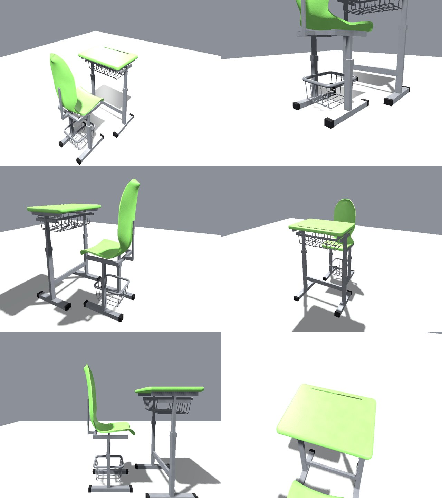
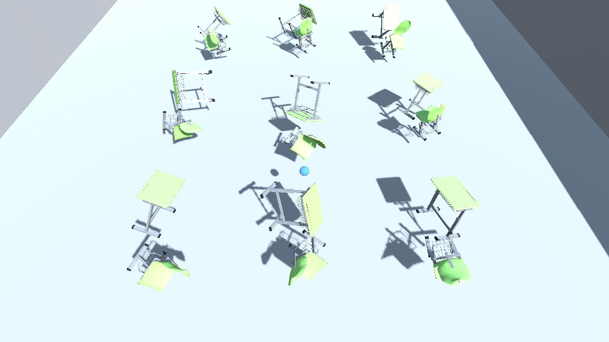
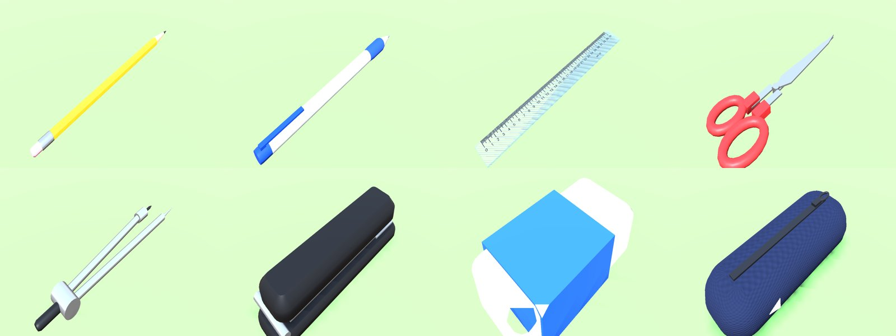
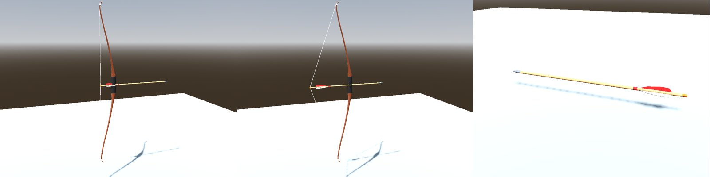
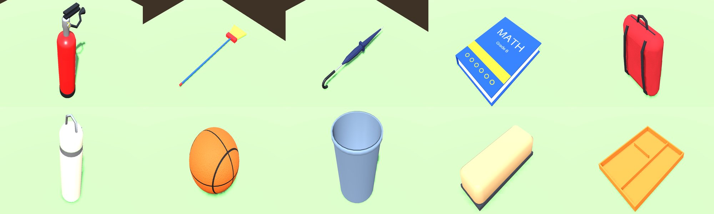
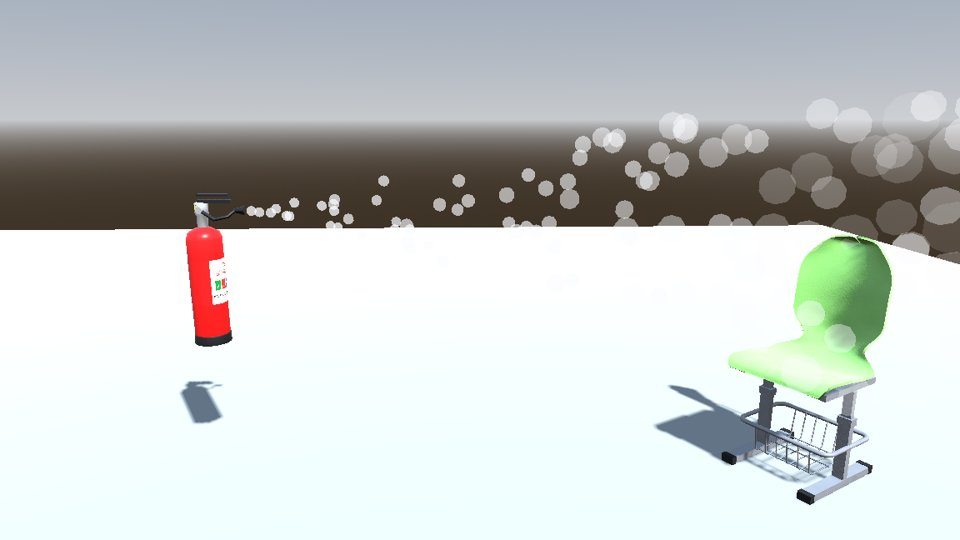
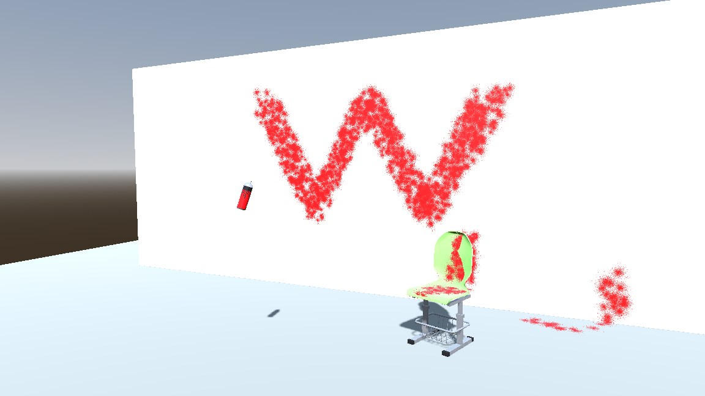
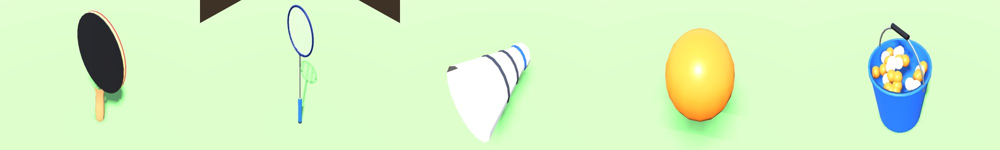
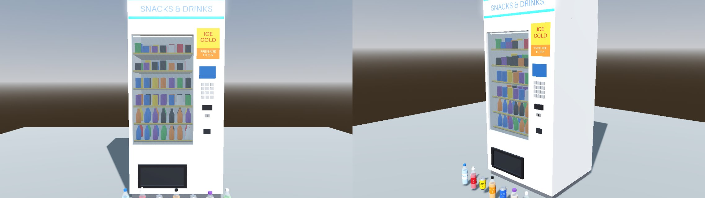
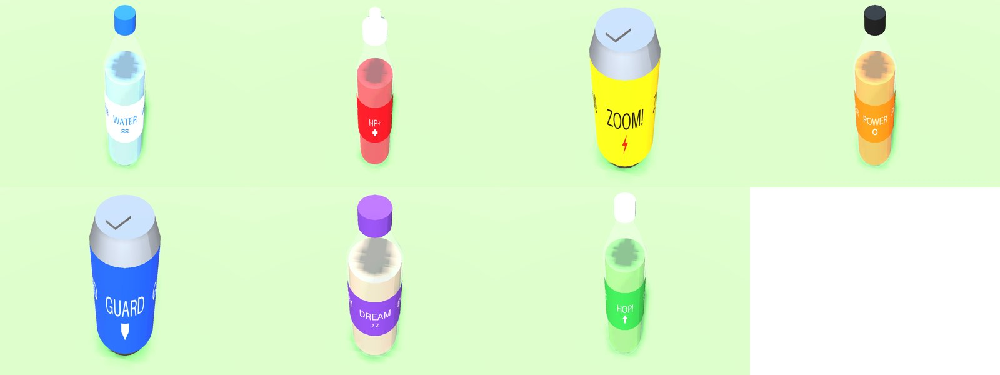

# Classroom props for a Godot 4 brawl game

A green plastic school desk and chair, modelled on the reference video, eight
pieces of stationery that work as weapons, a bow with arrows, ten everyday
school things to fight with (including a fire extinguisher that sprays foam),
ping pong and badminton gear, a vending machine that sells potions, and red
spray paint that really paints. Everything is
a ready-to-use physics prop: you can push it, pick it up and throw it, the
weapons can also stab, swing or shoot, and it all stays in sync in online or LAN
multiplayer.




## What's inside

```
assets/classroom_furniture/
  models/school_desk.glb      desk mesh, 884 tris, 3 materials
  models/school_chair.glb     chair mesh, ~5.9k tris, 3 materials
  textures/*.png              tileable 1024² PBR textures (albedo / normal / ORM)
  scenes/school_desk.tscn     RigidBody3D, 9 kg, 7 box colliders, net-synced
  scenes/school_chair.tscn    RigidBody3D, 4.5 kg, 7 box colliders, net-synced
  scripts/networked_prop.gd   pick up / throw / drop / hit detection + replication
  scripts/prop_holder.gd      component you put on your player's hands
demo/                         playable test level (9 desk + chair sets)
tests/                        headless physics + two-process network tests
tools/                        generators that rebuild the models, textures and scenes
```

**How it looks**
- **Desk:** 70 × 48 cm moulded top with a rounded rim and a pen groove along the
  back edge. It sits on grey powder-coated steel: single-post height-adjustable
  legs, floor foot bars with black rubber caps, a low stretcher, and a sheet-steel
  book tray open towards the student. The top is 76 cm high.
- **Chair:** one-piece green plastic shell with a curved seat, pinched waist and
  round-topped backrest, on a grey steel frame with wide flat foot bars and
  chunky rubber caps. Under the seat is a low wire basket: a bent round-tube rim
  welded to both posts and running a little past them (39 cm long), with
  U-shaped wires. Seat height is 44 cm.
- **Colours** are sampled from the video. The phone's dark, desaturated filter is
  corrected out (using the white floor tiles as the white reference), which gives
  plastic `#8BC76D` and steel `#8E9094`. To change them, edit `PLASTIC_GREEN` /
  `STEEL_GREY` in `tools/generate_assets.py` and run it again.
- **Scale:** 1 unit = 1 m, +Y up, origin on the floor, and the student side faces +Z.

## Using it in your game (Godot 4.3+)

1. Copy the `assets/classroom_furniture` folder into your project at the
   **same path** (`res://assets/classroom_furniture`). If you'd rather put it
   somewhere else, move it inside the Godot editor so the paths get fixed for you.
2. Drag `school_desk.tscn` / `school_chair.tscn` into your level. Copies placed
   in the level are synced automatically, as long as every peer loads the same
   level. For furniture created while the game runs, add the two scenes to a
   `MultiplayerSpawner`'s *Auto Spawn List*.
3. Add a `PropHolder` node (`prop_holder.gd`) to your player, where the hands
   are. Then call it from the player's input code on the peer that controls
   that player:

   ```gdscript
   @onready var hands: PropHolder = $Hands

   func _unhandled_input(event):
       if not is_multiplayer_authority(): return
       if event.is_action_pressed("grab_throw"): hands.toggle_grab_throw()
       if event.is_action_pressed("drop"):       hands.drop()
   ```

   The holder must be owned by that player's peer. That's automatic if you call
   `set_multiplayer_authority(peer_id)` on the player root, which is the usual
   pattern. Also, the player's transform has to be replicated to the host.
   Optionally, set `aim_node` to your camera or head so throws go where the
   player looks.
4. Deal damage on hits. Fast props sweep one physics step ahead, so impacts
   register even when continuous collision detection stops the prop before it
   touches anything (Godot reports no contact then). The host emits
   `hit(body, impact_speed, thrower_peer_id)` on the prop, and if the body that
   was hit has a method `on_prop_hit(prop, impact_speed, thrower_peer_id)`, it
   calls that too:

   ```gdscript
   func on_prop_hit(prop, speed, thrower_id):
       health -= int(speed * 2)   # runs on the host; replicate health as usual
   ```
5. Let players knock furniture over by running into it. A `CharacterBody3D`
   (the usual player node) can't push physics objects by itself; it stops
   against them like a wall. Add one line after `move_and_slide()` in your
   player's movement code:

   ```gdscript
   var v := velocity          # remember it: move_and_slide() removes the blocked part
   move_and_slide()
   NetworkedProp.push_from_character(self, v)
   ```

   It works online too: clients send the push to the host, which moves the
   furniture for everyone. Online, the character bumps the furniture for a
   moment (about half the ping) before it starts sliding. If your players are
   `RigidBody3D`s instead, they push furniture without this line.

**Tuning** (in the Inspector, on each prop): `throw_speed`, `throw_lift`,
`throw_spin`, `max_pickup_distance`, `hold_offset` (where the prop sits relative
to the hands), `damage_min_speed`, `push_strength` (lower = heavier to shove),
`max_push_speed`, plus `mass` and the physics material.

### How the networking works

- **The host runs the physics.** The prop's multiplayer authority (peer 1)
  simulates it as a real `RigidBody3D`.
- **Clients follow the host.** On clients the prop is frozen as *kinematic*, so
  players still bump into it, and it smoothly follows the replicated position,
  rotation, velocity and holder.
- **Players ask, the host decides.** Pick up, throw and drop are reliable RPCs
  to the host, which checks them: in range, not already held, one prop per
  player. A held or just-thrown prop ignores its holder, so you don't hit
  yourself.
- **Resting furniture costs no bandwidth.** Sync uses *on-change* replication
  at about 30 Hz.
- **Offline needs no extra code.** With no network peer, Godot acts as peer 1,
  so single player and same-screen local multiplayer use the same code path.

## Stationery weapons



Eight items in `assets/stationery/` (it uses the scripts in
`assets/classroom_furniture/scripts/`, so copy both folders). Each is a
`StationeryWeapon`: everything a furniture prop does, plus melee attacks, thrown
damage and, for pointy items, sticking into walls.

| Item | Attack | Melee damage | Notes |
|---|---|---|---|
| Pencil | stab | 12 | flies tip-first, sticks into walls |
| Ballpoint pen | stab | 10 | flies tip-first, sticks into walls |
| Scissors | stab | 18 | flies tip-first, sticks into walls |
| Compass (drawing) | stab | 15 | flies tip-first, sticks into walls |
| Ruler (30 cm) | swing | 8 | spins when thrown |
| Stapler | swing | 16 | heavy, hits hardest when thrown |
| Eraser | swing | 4 | light, quick |
| Pencil case | swing | 7 | the navy pouch from the video |

**Using them:**
1. Drop the scenes from `assets/stationery/scenes/` into your level (on desks,
   for example).
2. Players pick them up and throw them with the same `PropHolder` as the
   furniture. For a melee attack, call `$Hands.attack()`:

   ```gdscript
   if event.is_action_pressed("attack"): $Hands.attack()
   ```

3. Take damage in your player script. The host calls this on whatever got hit
   (`kind` is `"stab"`, `"swing"` or `"throw"`):

   ```gdscript
   func on_weapon_hit(weapon, damage, attacker_peer_id, kind):
       health -= damage   # runs on the host; replicate health as usual
   ```

   If your player only has `on_prop_hit` (from the furniture), weapons call
   that instead.

**How the attacks work:**
- **Stab:** a quick lunge that hits the first thing in a thin line in front of
  the hand (`melee_range`, about 0.8 m).
- **Swing:** an arc that hits everything in a wide area in front, and knocks
  loose props aside.
- **Throw:** damage = impact speed × `throw_damage_per_speed`. Pointy items
  steer tip-first in flight like a dart, deal 1.5× damage when they land tip
  first, and stick into walls and floors until someone pulls them out by
  grabbing them.
- **Cooldown:** `attack_cooldown` per item, checked on the host.

All of these are Inspector settings on each item, so you can rebalance without
touching code. Attacks are requested by the holder and resolved on the host,
like pickups and throws.

## Bow and arrows



`assets/archery/` has a recurve bow and an arrow. They are separate pickups
that work together. It uses the scripts in `assets/classroom_furniture/` and
`assets/stationery/`, so copy all three folders.

**How it plays:**
- **Load:** pick up the bow, then press grab near an arrow. The arrow goes into
  the bow instead of your hand. A bow carries up to 12 arrows: one sits on the
  string, the rest are stowed (hidden).
- **Shoot:** hold attack to draw (full draw takes 0.7 s), release to shoot. A
  full draw fires at 40 m/s for about 48 damage; a quick tap fires at about
  12 m/s for about 15.
- **Arrows:** they fly tip-first, stick into walls and the floor, and can be
  collected straight back into the bow from there. Hits are reported with kind
  `"shot"` and credited to the archer.
- **Empty bow:** attack swings it as a club (9 damage).
- **Dropping or throwing the bow** spills the arrows it carries.
- **An arrow on its own** is a small pointy weapon: stab (8 damage) or throw it
  like a dart.

**Wiring:** the bow needs the attack button's *release* as well:

```gdscript
if event.is_action_pressed("attack"): $Hands.attack()           # draw / stab / swing
if event.is_action_released("attack"): $Hands.attack_release()  # shoot
```

Grab (`$Hands.try_grab()` or `toggle_grab_throw()`) already loads arrows when
you're holding the bow. Damage arrives through the same
`on_weapon_hit(weapon, damage, attacker_peer_id, kind)`.

Bow settings in the Inspector: `max_arrows`, `shoot_speed`, `min_draw`,
`draw_time`, `draw_length`, `collect_range`. Arrow damage per m/s is the
arrow's `throw_damage_per_speed`.

## Everyday school items



`assets/school_items/` has ten more things you'd find at school. They're
`StationeryWeapon`s too, so pickup, throwing and melee work like the
stationery. Copy it together with `assets/classroom_furniture` and
`assets/stationery`.

| Item | Attack | Melee damage | Special |
|---|---|---|---|
| Fire extinguisher | swing | 20 | hold attack to **spray foam**; bursts when thrown hard |
| Broom | swing | 9 | longest reach (1.7 m) |
| Umbrella | stab | 11 | long reach (1.35 m) |
| Textbook | swing | 10 | spins flat when thrown |
| Backpack | swing | 13 | heavy knockback |
| Water bottle | swing | 9 | the cream insulated bottle from the photo |
| Basketball | swing | 5 | bounces (about 64% of its drop height) |
| Trash bin | swing | 14 | heaviest knockback, hits hard when thrown |
| Whiteboard eraser | swing | 4 | light and fast, good for throwing |
| Lunch tray | swing | 10 | flies flat like a frisbee |

**Knockback:** most of these push the person they hit. If your player script
has `apply_knockback(velocity: Vector3)`, the host calls it with the push to
apply, for example:

```gdscript
func apply_knockback(v: Vector3):
    velocity += v   # on your CharacterBody3D; runs on the host
```

### Fire extinguisher



- **Spray:** hold attack (`$Hands.attack()` on press,
  `$Hands.attack_release()` on release) to spray foam in a 22° cone up to
  4 m. Every 0.1 s it deals a little damage (6 per second, kind `"spray"`),
  pushes players back through `apply_knockback`, and shoves loose furniture (a
  second or so of spray slides a chair about a metre). Foam doesn't go through walls, and every
  player sees the foam particles.
- **Foam runs out:** a full extinguisher sprays for 8 seconds. `spray_charge`
  (1 down to 0) is synced, so you can show it on a HUD; call `refill()` on
  the host to top it up.
- **Empty,** attack is a heavy swing (20 damage).
- **Burst:** thrown into something at 9 m/s or more with foam left, it bursts.
  Everyone within 2.5 m takes 10 damage (kind `"burst"`) and gets knocked
  back.

### Spray paint



`assets/school_items/scenes/spray_paint.tscn`: a can of **red** spray paint
that really paints.

- **Spraying:** hold attack (`$Hands.attack()` on press,
  `$Hands.attack_release()` on release). A red mist comes out, and **paint
  marks appear on whatever it hits**: walls, floors, desks, chairs, players.
  It reaches 4 m.
- **Paint sticks:** marks stay on what they hit, so a painted chair keeps its
  paint when it's thrown.
- **Painted players:** they get the `painted` status effect for 4 s, which
  you can use for a red-tinted screen, a tracking marker and so on.
- **Running out:** a can holds 20 seconds of spraying (`paint`, synced).
  Empty, it's a small club.
- **Multiplayer:** everyone sees the same paint, including players who join
  after it was sprayed.
- **Mark limit:** each can keeps up to 600 marks (`max_marks`); the oldest
  disappear first.
- **Other colours:** the colour is the `paint_color` setting, so a blue or
  green can is just a copy of the scene with a different colour.

## Ping pong and badminton



`assets/sports/` (needs `classroom_furniture` and `stationery` too):

| Item | What it does |
|---|---|
| Ping pong paddle | Swing (7 damage). **Bats** loose light things in front of it (balls, shuttlecocks, a thrown pencil...) back along your aim at 16 m/s; their hits count as yours |
| Badminton racket | Longer swing (1.25 m, 6 damage), smashes things at 24 m/s |
| Shuttlecock | Flies nose-first and slows down like a real one |
| Ping pong ball | Tiny, very bouncy, throwable (does very little damage) |
| Ball bucket | Attack fires a **volley of balls** in a cone. Everyone hit takes 2 damage and **falls asleep** for 2.5 s (`sleep` status effect). It uses 6 of its 30 balls per volley; hold the bucket and grab near loose balls to refill it. Nearly empty, it swings like a club |

## Vending machine and potions




`assets/vending/` (needs `classroom_furniture` and `stationery` too). The
machine is in the style of the photo, but deliberately without any real
store's name, logo or stripe colours.

**The machine:**
- **Buying:** stand in front of it and call `$Hands.use()`. It drops a random
  drink in front of the pickup tray. Water is the most common, sleep potions
  the rarest; you can change the odds with `weights`, or pick one with
  `request_use(index)`.
- **Limits:** each player waits 2 seconds between buys, and it holds 24
  drinks (`stock`, synced; −1 = unlimited).
- **Networking:** dispensed drinks are created on the host and appear for
  everyone through the machine's own `MultiplayerSpawner`, including players
  who join later.

**Drinks:** hold one and press attack to drink it (0.7 s), which empties the
bottle. Throw a full one at something and it splashes everyone within 2.5 m.

| Drink | Drink it | Throw it |
|---|---|---|
| Water (plastic bottle) | heal 15 | leaves a **slippery puddle** (`slip`) for 15 s |
| Health potion "HP+" | heal 50 | heals everyone nearby 25 |
| Speed "ZOOM!" | `speed` ×1.6 for 8 s | everyone nearby ×1.6 for 4 s |
| Strength "POWER" | `strength` ×1.5 for 10 s | everyone nearby for 5 s |
| Shield "GUARD" | `shield` ×0.5 damage taken, 10 s | everyone nearby for 5 s |
| Sleep "DREAM" | you fall asleep for 4 s (a prank drink) | everyone nearby sleeps 3 s |
| Jump "HOP!" | `jump` ×1.5 for 10 s | everyone nearby for 5 s |

Empty bottles are light clubs. **To remove a potion**, delete its scene from
`assets/vending/scenes/` and remove it from the machine's `products` list and
its `MultiplayerSpawner`. Or delete its line in `DRINKS` in
`tools/generate_vending.py` and regenerate.

### Status effects (sleep, slip, speed...)

Add a **`StatusEffects`** node (`assets/classroom_furniture/scripts/status_effects.gd`)
as a child of your player. Effects are decided by the host and synced to
everyone. Your player code decides what each one does:

```gdscript
@onready var fx: StatusEffects = $StatusEffects

func _physics_process(delta):
    if fx.is_active(&"sleep"): return                 # can't move or act
    var speed := run_speed * fx.strength_of(&"speed", 1.0)
    if fx.is_active(&"slip"): pass                     # e.g. keep sliding, ignore steering
    ...

func take_damage(amount):
    health -= amount * fx.strength_of(&"shield", 1.0)
```

Healing goes to your player's `heal(amount)` method if it has one (otherwise
the node's `healed` signal fires). Prefer your own system? Give your player
`apply_status_effect(effect, duration, strength, source_peer_id)` and that's
used instead.

## Try the demo

Open the folder in Godot 4.3+ and press F5. There's a piece of stationery on
every desk, a bow with 5 arrows on the floor at the front left, fire
extinguishers by the side walls, the other school items around the room, a
vending machine at the front, a can of red spray paint near the front wall, a
ping pong corner (front right) and a badminton corner (left).

| Input | Action |
|---|---|
| Mouse | Move your hand (coloured ball) |
| Left mouse button | Grab or throw |
| Right mouse button | Drop |
| E or middle mouse button | Stab or swing; with the bow, hold to draw and release to shoot; with the fire extinguisher or spray paint, hold to spray; with a drink, drink it; with the ball bucket, fire a volley |
| F | Use the vending machine |
| Left mouse button near an arrow (holding the bow) | Load the arrow |
| Space | Shockwave |
| R | Reset furniture |
| F1 | Host on port 7777 |
| F2 | Join 127.0.0.1 |

To test across your LAN, run one copy with `-- --host` and another with
`-- --join=<host IP>`.

## Tests

```bash
godot --headless --path . --import
godot --headless --path . --script res://tests/physics_test.gd      # offline
godot --headless --path . --script res://tests/stationery_test.gd   # offline
godot --headless --path . --script res://tests/archery_test.gd      # offline
godot --headless --path . --script res://tests/school_items_test.gd # offline
godot --headless --path . --script res://tests/sports_vending_test.gd # offline
godot --headless --path . --script res://tests/spray_paint_test.gd  # offline
godot --headless --path . --script res://tests/net_test.gd -- server &
godot --headless --path . --script res://tests/net_test.gd -- client  # ENet localhost
```

Both suites pass on Godot 4.3. The physics test checks that the props settle
upright, can be grabbed, follow the hand, get thrown at about 13 m/s, report
wall hits, and get shoved (about 5 m, knocked over) by a character running into
them at 5 m/s.

The stationery test checks, for every item, that it rests on the floor, can be
grabbed, stabs or swings once per cooldown for its listed damage, deals damage
when thrown at a wall and at a character, and (pointy items) sticks into the
wall and can be pulled back out.

The archery test loads three arrows into the bow, checks only one is on the
string and that nobody else can take them, shoots at full draw (40 m/s, sticks
tip-first into a wall 12 m away), shoots a quick tap at a character, collects
the stuck arrow back, spills arrows when the bow is dropped, swings the empty
bow, and stabs with an arrow by hand.

The school items test checks each item rests on the floor, can be picked up,
hits (and knocks back) for its listed damage, and does damage when thrown.
It also checks the tray and textbook spin flat and the basketball bounces. For
the fire extinguisher it checks that the spray repeatedly hits and pushes a
target in front, misses one outside the cone and one behind a wall, shoves a
chair, and uses up foam; that the empty extinguisher swings; and that throwing
it into a wall bursts and knocks back a bystander.

The sports and vending test checks that every new item rests and can be picked
up. For the sports gear: the paddle bats a ball into a player (credited to the
batter), the ping pong ball bounces, the racket smashes a shuttlecock which turns
nose-first and slows down, and the bucket's volley puts the player in front to
sleep (not one outside the cone or behind a wall), uses balls, has a cooldown,
wears off, refills from loose balls and swings when nearly empty. For vending:
the machine sells a drink in front of its tray, has a per-player cooldown, sells
a chosen product and stops when empty. For drinks: drinking heals or applies
the effect and empties the bottle, a thrown water bottle leaves a puddle that
makes players slip, and sleep and health potions splash everyone nearby.

The spray paint test checks that holding attack sprays and releasing stops, and
that a second of spraying leaves dozens of marks lying flat on the wall where
you aimed. It also checks that paint marks a chair and moves with it, that a
sprayed player gets `painted`, that marks are capped, and that the can runs out
and then swings.

In the network test a client's character shoves a chair through the host, then
the client grabs a chair and throws it; the host sees the pickup, the flight
and hits credited to that client. Finally the client grabs a pencil off a desk,
stabs a target on the host and throws the pencil into a wall, where both sides
see it stuck. Last, the client picks up the bow, loads an arrow, draws and
shoots it into a wall; both sides see the draw and the stuck arrow, and the
host credits the shot to the client. Then the client picks up a fire
extinguisher and sprays a target on the host: both sides see the spray, and the
host registers the foam hits and knockback for the client. Then the client
buys a drink from the vending machine (both sides see it appear at the
machine), drinks it, and fires a ball volley that puts a target to sleep. The
sleep effect syncs from the host to the client. For spray paint, the host paints
the front wall before the client joins and the client still sees every mark;
then the client paints the wall and the host sees it.

## Rebuilding the assets

```bash
pip install numpy pillow
python3 tools/generate_assets.py   # models + textures
python3 tools/make_scenes.py       # prop scenes / colliders
python3 tools/generate_stationery.py   # stationery models, textures, scenes
python3 tools/generate_archery.py      # bow and arrow models, scenes
python3 tools/generate_school_items.py # school item models, textures, scenes
python3 tools/generate_sports.py       # ping pong / badminton models, scenes
python3 tools/generate_vending.py      # vending machine, drinks, labels, scenes
```
